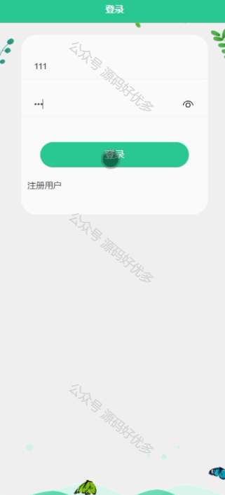

 
## 查看主页获取源码

> **作者介绍**： **✌**全网粉丝10W+本平台特邀作者、博客专家、CSDN新星计划导师、java领域优质创作者,博客之星、掘金/华为云/阿里云/InfoQ等平台优质作者、专注于项目实战 **✌**

  

### 一、作品包含

源码+数据库+设计文档万字+PPT+全套环境和工具资源+部署教程

### 二、项目技术

前端技术：Html、Css、Js、Vue、Element-ui

数据库：MySQL

后端技术：Java、Spring Boot、MyBatis

  

### 三、运行环境

开发工具：IDEA/eclipse + 微信开发者工具

数据库：MySQL5.7

数据库管理工具：Navicat10以上版本

环境配置软件： JDK1.8+Maven3.6.3

前端Nodejs：14

### 四、项目介绍
项目编号：mpweixinA046

诗词学习APP及微信小程序以弘扬中华优秀传统文化为背景，结合现代科技手段，为广大诗词爱好者提供了一个便捷的学习平台。通过丰富的诗词资源、专业的解读、互动式体验，该应用旨在激发用户对古典诗词的兴趣，提高文学素养，让传统文化在新时代焕发新的活力。

前台用户功能：浏览首页、诗人简介、用户原创、挑战、我的收藏管理、错题本、挑战记录。

后台管理员的功能：系统首页、个人中心、用户管理、诗词分类管理、诗人简介管理、诗词赏析管理、朝代管理、用户原创管理、诗词挑战管理、试题管理、系统管理、挑战管理。

### 五、运行截图

  
